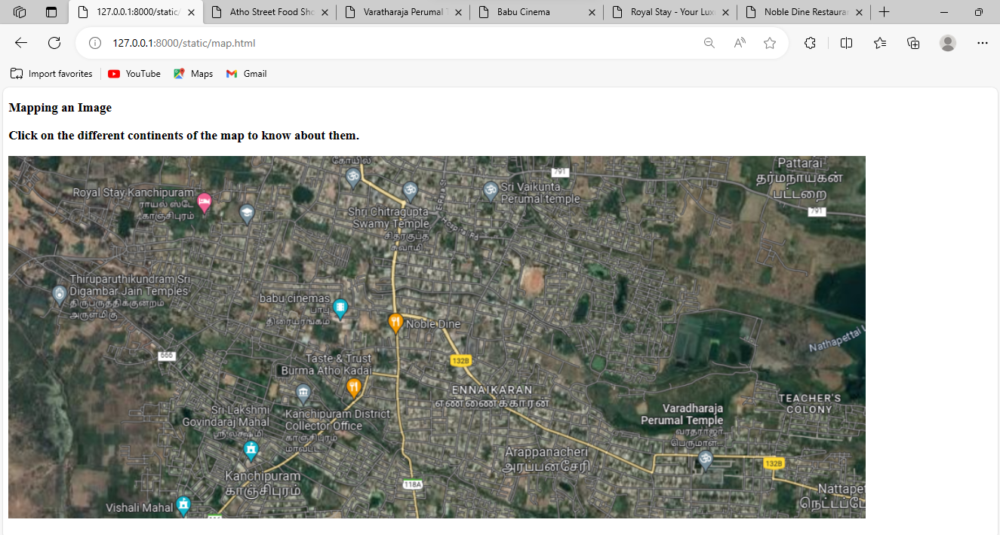

# Ex04 Places Around Me
### Date: 19/10/2023
## AIM
To develop a website to display details about the places around my house.

## DESIGN STEPS

### STEP 1
Create a Django admin interface.

### STEP 2
Download your city map from Google.

### STEP 3
Using ```<map>``` tag name the map.

### STEP 4
Create clickable regions in the image using ```<area>``` tag.

### STEP 5
Write HTML programs for all the regions identified.

### STEP 6
Execute the programs and publish them.

## CODE
### Map.html
```
<!DOCTYPE html> 
<html> 

<h3>Mapping an Image 

<body> 

<p>Click on the different continents of the map to know about them.</p> 


<map name="image-map">
    <area target="_blank" alt="Noble Dine" title="Noble Dine" href="nobledine.html" coords="713,279,531,215" shape="rect">
    <area target="_blank" alt="Babu Cinemas" title="Babu Cinemas" href="babucinemas.html" coords="363,198,503,260" shape="rect">
    <area target="_blank" alt="Royal Stay" title="Royal Stay" href="royalstay.html" coords="80,37,305,104" shape="rect">
    <area target="_blank" alt="Varadharaja Perumal Temple" title="Varadharaja Perumal Temple" href="varatharajaperumal.html" coords="918,357,1086,472" shape="rect">
    <area target="_blank" alt="Atho Kadai" title="Atho Kadai" href="AthoKadai.html" coords="388,292,548,356" shape="rect">
</map>


</body> 
</html> 
```
### nobledine.html
```
<!DOCTYPE html>
<html>
<head>
    <meta charset="UTF-8">
    <title>Noble Dine Restaurant</title>
    <link rel="stylesheet" type="text/css" href="styles.css">
</head>
<body bgcolor="lightgreen">
    <header>
        <h1>Welcome to Noble Dine Restaurant</h1>
        <nav>
            <ul>
                <li><a href="#menu">Menu</a></li>
                <li><a href="#about">About Us</a></li>
                <li><a href="#contact">Contact</a></li>
            </ul>
        </nav>
    </header>

    <section id="menu">
        <h2>Our Menu</h2>
        <p>Explore our delicious menu options.</p>
        <ul>
            <li>Appetizers</li>
            <li>Main Courses</li>
            <li>Desserts</li>
            <li>Drinks</li>
        </ul>
    </section>

    <section id="about">
        <h2>About Us</h2>
        <p>Welcome to Noble Dine Restaurant, where we serve mouthwatering dishes made with the finest ingredients.</p>
    </section>


</body>
</html>
```
### royalstay.html
```
<!DOCTYPE html>
<html>
<head>
    <meta charset="UTF-8">
    <title>Royal Stay - Your Luxury Accommodation</title>
    <link rel="stylesheet" type="text/css" href="styles.css">
</head>
<body bgcolor="blue">
    <header>
        <h1>Welcome to Royal Stay</h1>
        <nav>
            <ul>
                <li>Rooms</li>
                <li>Amenities</li>
                <li>About Us</li>
            </ul>
        </nav>
    </header>

    <section id="rooms">
        <h2>Our Rooms</h2>
        <p>Experience luxury and comfort in our beautifully appointed rooms.</p>
        <ul>
            <li>Standard Room</li>
            <li>Deluxe Suite</li>
            <li>Presidential Suite</li>
        </ul>
    </section>

    <section id="amenities">
        <h2>Amenities</h2>
        <p>Discover the amenities and services we offer to make your stay truly special.</p>
        <ul>
            <li>Swimming Pool</li>
            <li>Restaurant</li>
            <li>Spa & Wellness Center</li>
        </ul>
    </section>

    <section id="about">
        <h2>About Us</h2>
        <p>Learn more about Royal Stay, where we provide an unforgettable experience to our guests.</p>
    </section>

   

</body>
</html>
```
### babucinemas.html
```
<!DOCTYPE html>
<html>
<head>
    <meta charset="UTF-8">
    <title>Babu Cinema</title>
    <link rel="stylesheet" type="text/css" href="styles.css">
</head>
<body bgcolor="lightblue">
    <header>
        <h1>Welcome to Babu Cinema</h1>
    </header>

 

    <section id="schedule">
        <h2>Showtimes</h2>
        <p>View our movie showtimes and plan your visit.</p>
        <table>
            <tr>
                <th>Movie</th>
                <th>Showtimes</th>
            </tr>
            <tr>
                <td>Leo</td>
                <td>10:00 AM, 2:30 PM, 7:00 PM</td>
            </tr>
            <tr>
                <td>Bigil</td>
                <td>11:00 AM, 3:30 PM, 8:00 PM</td>
            </tr>
        </table>
    </section>

    <section id="about">
        <h2>About Us</h2>
        <p>Discover Babu Cinema, where we bring the magic of movies to life.</p>
    </section>


</body>
</html>
```
### varatharajaperumal.html
```
<!DOCTYPE html>
<html>
<head>
    <meta charset="UTF-8">
    <title>Varatharaja Perumal Temple</title>
    <link rel="stylesheet" type="text/css" href="styles.css">
</head>
<body bgcolor="orange">
    <header>
        <h1>Varatharaja Perumal Temple</h1>
        <nav>
            <ul>
                <li>History</li>
                <li>Architecture</li>
                <li>Festivals</li>
            </ul>
        </nav>
    </header>

    <section id="history">
        <h2>History</h2>
        <p>Learn about the rich history of Varatharaja Perumal Temple.</p>
    </section>

    <section id="architecture">
        <h2>Architecture</h2>
        <p>Explore the architectural beauty of this magnificent temple.</p>
    </section>

    <section id="festivals">
        <h2>Festivals</h2>
        <p>Discover the vibrant festivals celebrated at Varatharaja Perumal Temple.</p>
    </section>

   
</body>
</html>
```
### AthoKadai.html
```
<!DOCTYPE html>
<html>
<head bgcolor="yellow">
    <meta charset="UTF-8">
    <title>Atho Street Food Shop</title>
    <link rel="stylesheet" type="text/css" href="styles.css">
</head>
<body>
    <header>
        <h1>Welcome to Atho Street Food Shop</h1>
        <nav>
            <ul>
                <li>Menu</li>
                <li>About Us</li>
            </ul>
        </nav>
    </header>

    <section id="menu">
        <h2>Our Menu</h2>
        <p>Explore our delicious street food offerings.</p>
        <ul><li>Egg Atho</li>
            <li>Noruku Bejo</li>
            <li>Mohinga</li>
            <li>Soups</li>
            <li>Khow Suey</li>
            <li>Spicy Noodles</li></ul>  
    </section>

    <section id="about">
        <h2>About Us</h2>
        <p>Learn about Atho Street Food Shop and our passion for serving tasty street food.</p>
    </section>

 
</html>
```

## OUTPUT



## RESULT
The program for implementing image maps using HTML is executed successfully.
